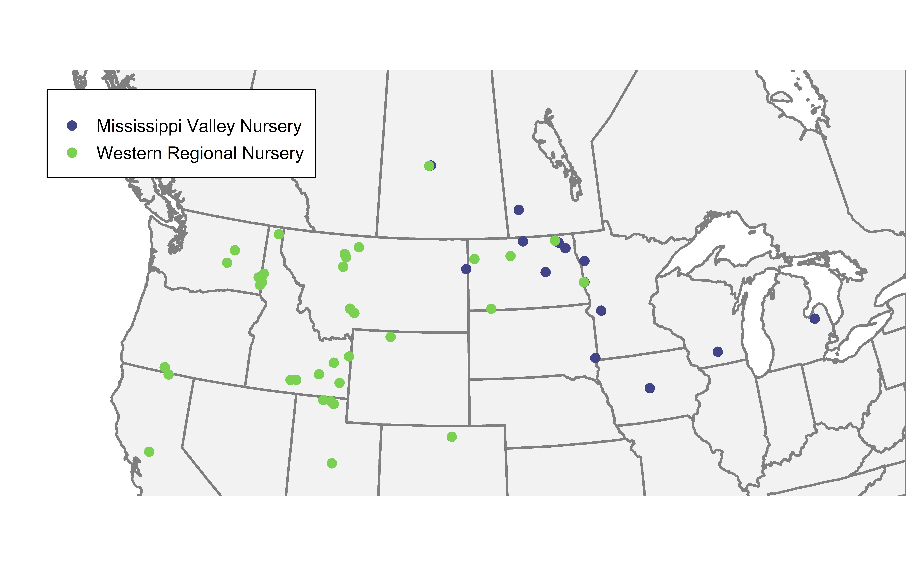

<!-- README.md is generated from README.Rmd. Please edit that file -->

# Barley Nursery Location Evaluation

## Description

The objective of this analysis was to evaluate the usefulness of trial
locations in two long-term barley nurseries. Trial usefulness was
defined by three criteria: i) average precision (i.e. ability to
discriminate superior genotypes), ii) repeatability (i.e. consistency of
genotypic rankings from year-to-year), and iii) mega-environment
representation (i.e. the degree to which a location represents a larger
mega-environment).

## Script Order
